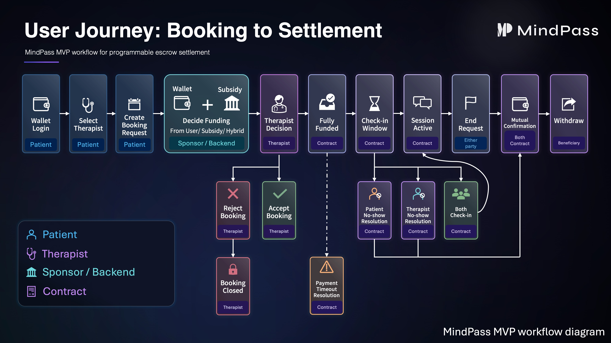

# MindPass

MindPass is a hybrid FinTech DApp prototype that demonstrates programmable escrow, subsidy-aware funding, and verifiable settlement for appointment-based digital services.

The project combines a Next.js application, a Solidity escrow contract, and a Supabase off-chain mirror to show how user-facing booking workflows can be coordinated with on-chain settlement state.

MindPass is an MVP and portfolio prototype. It is not production-ready and should not be presented as a complete healthcare, counselling, clinical-record, or compliance platform.

## Project Overview

MindPass explores a hybrid settlement model for appointment-based services:

- a patient/customer requests a session with a provider
- the provider accepts or rejects the request
- funding can come from a user wallet, a subsidy vault, or a mixed split
- on-chain escrow tracks payment windows, check-ins, no-show outcomes, completion, claimable balances, and withdrawals
- Supabase mirrors session state for the frontend dashboard, provider queue, chat/session lobby, and audit-style UI

The public portfolio focus is the FinTech escrow and settlement architecture, not clinical service delivery.

## Booking-to-Settlement Workflow



The diagram summarises the MVP journey from wallet login and booking request to funding, check-in/no-show handling, mutual confirmation, settlement, and withdrawal.

## Problem and FinTech Motivation

Appointment-based digital services often need more than a simple payment button. They need stateful settlement rules:

- the provider should not be paid before accepting and completing the service
- the user should not lose funds if a provider fails to appear
- subsidies or vouchers may need to fund part of the transaction
- both parties need a transparent record of status changes and settlement outcomes
- the application still needs a fast off-chain read model for dashboards and support workflows

MindPass demonstrates how programmable escrow can encode these rules while a conventional database mirrors state for product UX.

## Key Features

- Wallet-based patient/customer and provider entry flows
- Role-aware frontend routing and dashboard states
- Provider directory and booking request flow
- Subsidy-aware funding split calculation
- Sepolia-oriented escrow contract integration
- On-chain lifecycle helpers for booking, funding, check-in, timeout/no-show resolution, completion, and withdrawal
- Supabase session mirror with transaction hashes and settlement metadata
- Frontend tests for state transitions, funding logic, on-chain mapping, and settlement copy
- Hardhat contract test foundation for session completion behavior

## Tech Stack

- Frontend: Next.js, React, TypeScript, Tailwind CSS
- Web3: Wagmi, viem, RainbowKit, Sepolia
- Smart contract: Solidity, Hardhat, OpenZeppelin
- Database/read model: Supabase
- Testing: Node test runner for frontend logic, Hardhat for Solidity tests

## Architecture Overview

```text
User wallet
  -> Next.js frontend
  -> Wagmi / viem contract calls
  -> MindPassEscrow on Sepolia
  -> receipt/event decoding
  -> Supabase mirror updates
  -> dashboards, provider queue, session/chat UI
```

The contract is intended to be the settlement authority for escrow outcomes. Supabase is the application-facing read model used for fast UI rendering, realtime updates, and workflow metadata.

## Smart Contract Settlement Flow

The main contract is `contracts/MindPassEscrow.sol`.

Implemented lifecycle:

1. Patient/customer creates a booking request.
2. Provider accepts or rejects the request.
3. Patient wallet portion is funded if required.
4. Subsidy vault portion is funded if required.
5. A payment timeout can refund partially funded sessions.
6. Patient and provider check in before the no-show deadline.
7. If both check in, the session starts.
8. Either participant can request session completion; the other participant confirms.
9. Terminal outcomes assign claimable balances.
10. Participants withdraw claimable funds.

The contract uses OpenZeppelin `Ownable`, `Pausable`, and `ReentrancyGuard`.

## Supabase Off-Chain Mirror

Supabase stores the product read model, including:

- patient and provider wallet records
- booking/session rows
- funding split fields
- on-chain session id
- contract address and chain id
- transaction hash fields
- timeout and no-show timestamps
- settlement status and refund/payout amounts
- sync metadata

The public schema is in `supabase/schema.sql`. Fake local/demo data is in `supabase/seed.example.sql`.

The current mirror is prototype-level. A production system would need a replay-safe event indexer, reorg handling, stricter RLS policies, audited storage rules, and operational monitoring.

## Testing Status

Current automated coverage includes:

- frontend funding-source and booking calculations
- frontend session status normalization
- frontend no-show and timeout transition helpers
- on-chain event-to-Supabase mapping helpers
- withdrawal patch helpers
- provider/patient dashboard state models
- initial Hardhat tests for session completion and completion invalid states

Contract test coverage is not complete yet. Before using this as a stronger Web3 portfolio proof point, add tests for payment timeout, patient no-show, provider no-show, mixed refund splits, unauthorized callers, duplicate funding, duplicate check-in, pause behavior, and withdrawal balance reset.

## Known Limitations

- This is an MVP prototype, not a production application.
- Timeout and no-show resolution are user/service-triggered, not fully autonomous.
- Supabase mirror state can become inconsistent if transaction/event syncing fails.
- There is no full event indexer or replay/reorg-safe sync worker.
- RLS and storage policies are demo-level and not production-ready.
- Provider verification is application-level only.
- Contract constants use fixed demo fee values and short demo timing windows.
- No production key management, monitoring, incident response, or compliance process is included.

The following are outside the implemented MVP scope:

- encrypted clinical record storage
- IPFS-based clinical storage
- decentralised identity
- SBT credentialing
- secure messaging
- real therapist licensing
- production healthcare compliance

## Future Improvements

- Add full Hardhat lifecycle tests for all escrow outcomes.
- Add a replay-safe event indexer for contract-to-Supabase synchronization.
- Add automated timeout/no-show resolution through a service or keeper pattern.
- Replace demo RLS with wallet-aware access policies.
- Add safer storage policies for private uploads if storage is reintroduced.
- Improve deployment documentation and environment separation.
- Add architecture and settlement-flow diagrams.
- Add screenshots of the patient dashboard, provider queue, funding modal, and withdrawal UI.

## My Contribution

This repository is being prepared as a public portfolio version of a university group MVP. The public presentation focuses on the parts most relevant to software engineering and FinTech/Web3 architecture:

- Solidity escrow lifecycle design
- Next.js DApp workflow implementation
- Wagmi/viem transaction integration
- Supabase mirror schema and sync helpers
- frontend state modeling and test coverage
- documentation cleanup for honest MVP scope

## How To Run Locally

Prerequisites:

- Node.js 20+
- npm
- a Supabase project for local testing
- a WalletConnect project id only if testing QR/mobile wallet connections
- Sepolia RPC access if testing Web3 flows

Install root contract dependencies:

```bash
npm install
```

Install frontend dependencies:

```bash
cd frontend
npm install
```

Create local environment files from `.env.example` and fill in local/demo values only. Do not commit `.env`, `.env.local`, private keys, service role keys, or real WalletConnect project IDs.

For portfolio builds, `NEXT_PUBLIC_WALLETCONNECT_PROJECT_ID` can remain unset or use the `YOUR_PROJECT_ID` placeholder from `.env.example`. Replace it with your own WalletConnect Cloud project ID when testing real QR/mobile wallet connections.

Run the frontend:

```bash
cd frontend
npm run dev
```

Run frontend checks:

```bash
cd frontend
npm run lint
npm test
npm run build
```

Run contract tests:

```bash
npx hardhat test
```
